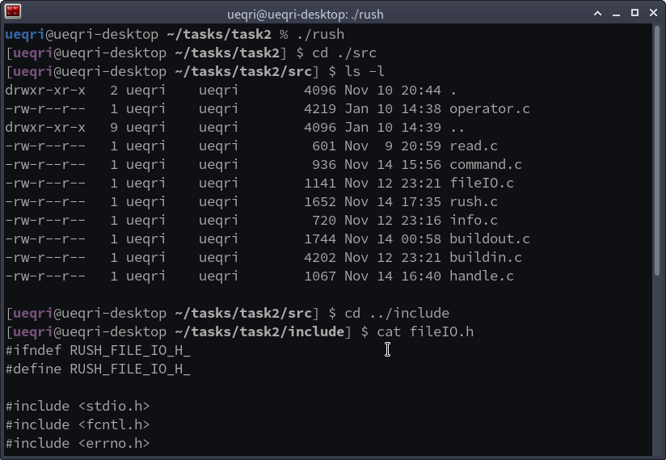

## UniqueLab 2019 Autumn Assignment 2

### 0x01 descriptions

a basic implementation of **shell** like bash, zsh, ash and etc.

### 0x02 requirements

- terminal part:
  - input commands in a line, and click Enter to run commands.
  - press left/right button to move the cursor.
  - use <CTRL+C> to kill the running command instantly; use <CTRL+D> to exit current terminal and go back to previous terminal.
- shell part (using **system call from libc**, absolutely forbid *void system(command)-like* function):
  - built-in command: `echo` `exit` `cd` `pwd` `kill`
  - some shell feature: 
    - I/O Redirect: `cat < foo.txt` `echo foobar > foo.txt` `cat < foo.txt > bar.txt`
    - Pipe: `cat < file_list | xargs cat > file_merge`
    - Background running: `command &`
  - built-out utilities: 
    - Environments settings: define an env-related file (*~/.rushrc*), and use built-in command `export PATH=$PATH:/usr/bin` ,  `export PATH=/absolute/path/to/:$PATH` or `export PATH=/absolute/path/to/` to set *env* or change the search priority.
    - List directory: `ls` shows simple list, `ls -l` shows more details.
    - Display files: `cat foo.txt` `more foo.txt`
    - Command *xargs*: execute arguments always with pipe, for example, `cat < file_list | xargs cat > file_merge`, and also use `xargs -d [delim]` to decide the delimiter character.
    - File methods: `touch foo.txt` modify the files' timestamps or create a file, `mkdir bar` , `cp foo bar` ,  `mv foo bar` , `rm [-r/-rf/-f] foo` , `ln foo bar` to create hard link, `ln -s foo bar` to create symbol link.

### 0x03 reference

man pages oriented

### 0x04 solutions

for details, please see `./include` `./src` `./utils` and compile with `-lreadline`.

you can use different kinds of methods of other common shell in this *rush* to try more features.

